# MusicPlayerApp

**MusicPlayerApp** is a modern and fully-featured Android music player application developed using **Java** and configured with **Gradle (Groovy scripts)**. The app offers a seamless music experience, supporting **online streaming**, **offline playback**, **playlist management**, and **downloads**, enabling users to enjoy their favorite music anytime, anywhere.

---

## Key Features

* **Online Streaming:** Stream music from online sources with minimal buffering and high quality.
* **Offline Playback:** Download and play music tracks without an internet connection.
* **Playlist Management:** Create, edit, and manage custom playlists for personalized listening.
* **Background Playback:** Music continues playing even when the app is minimized or the device is locked.
* **Media Controls:** Intuitive controls for play, pause, skip, and seek.
* **Search Functionality:** Quickly find songs in both local and online libraries.
* **Intuitive UI/UX:** Clean, responsive, and user-friendly interface for smooth navigation.
* **Error Handling:** User-friendly messages and safeguards for network or API issues.
* **Testing:** Fully tested Manually & with JUnit to ensure reliability and performance.

---

## Future Features

* **Download Management:** Efficiently monitor and manage downloaded music tracks.
* **Etc:** Additional enhancements and new features based on user feedback.

---

## App Screenshots

<p align="center">
  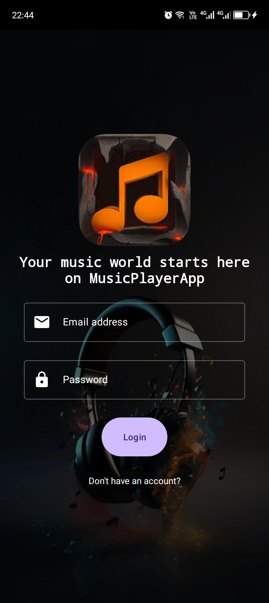  
  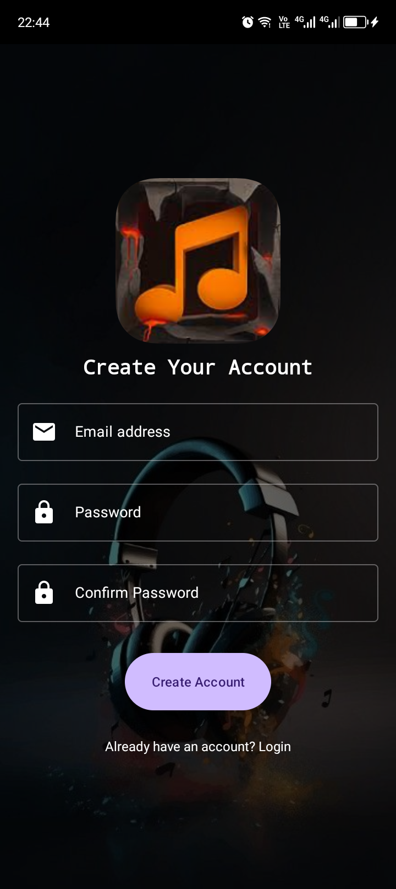  
  <br>Login screen and Register screen
</p>

<p align="center">
  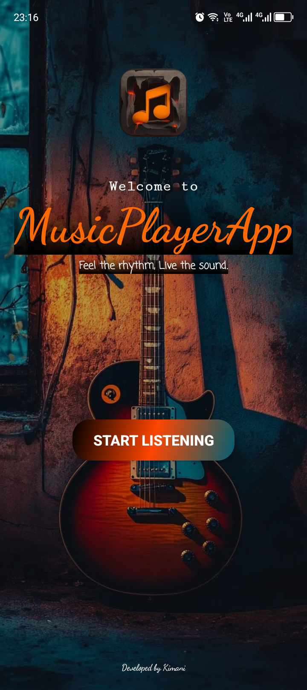  
  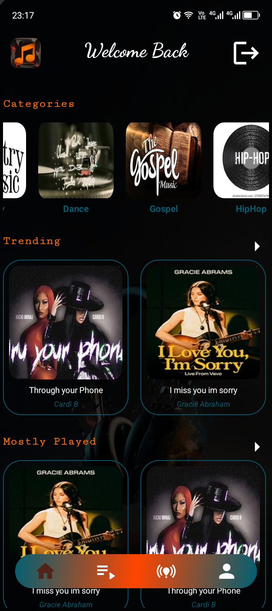  
  <br>Splash screen and Home screen
</p>

<p align="center">
  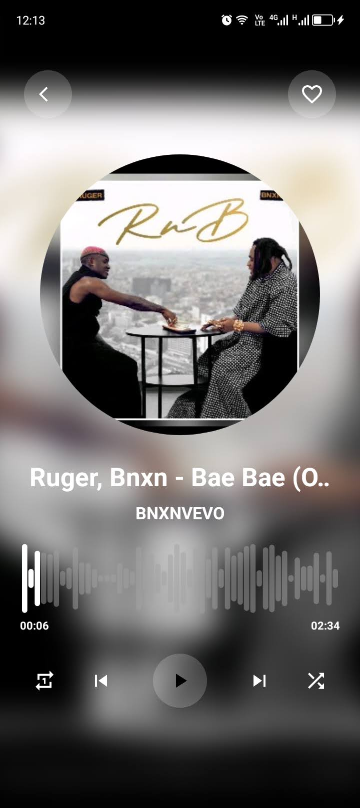  
  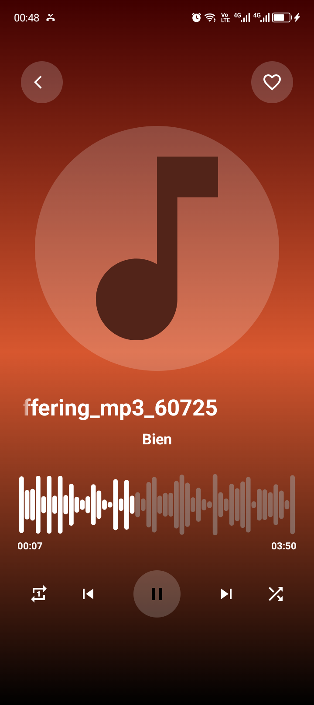  
  <br>Offline player screens
</p>

<p align="center">
  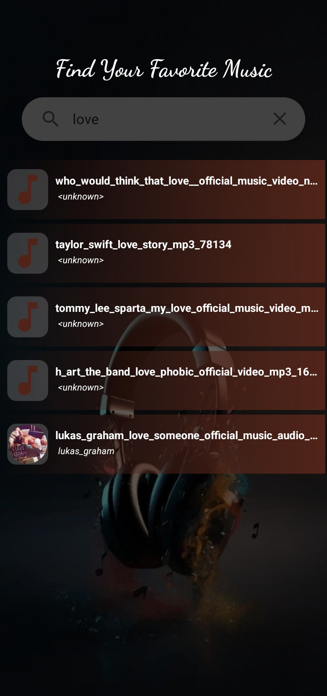  
  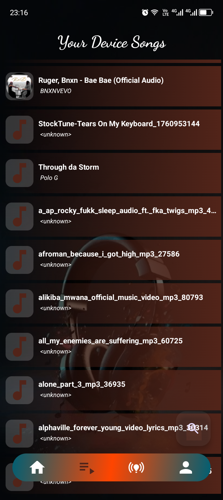  
  <br>Search feature mockup and Playlist screen
</p>

<p align="center">
  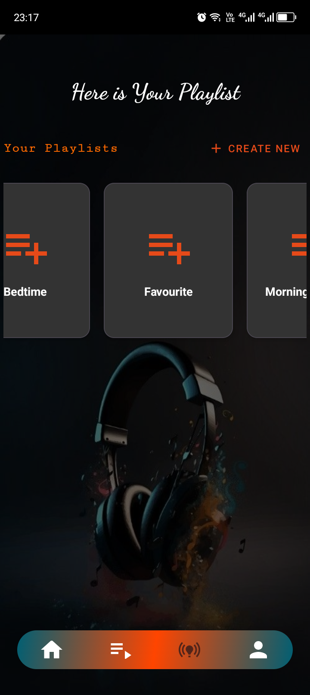  
  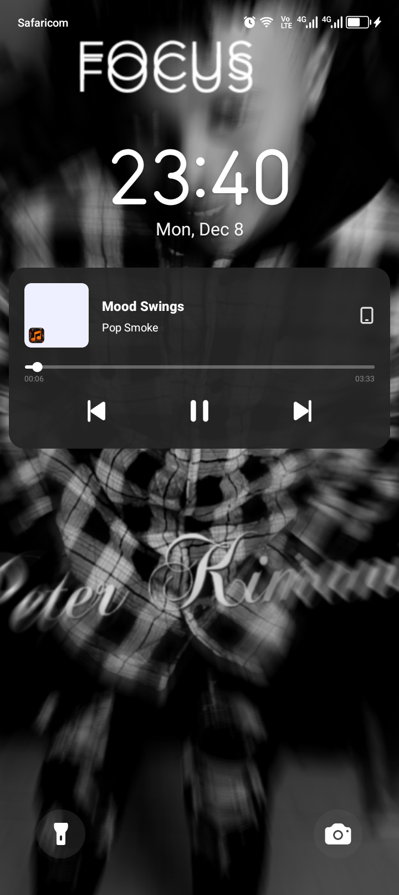  
  <br>Custom playlists and Lock screen playback
</p>

<p align="center">
  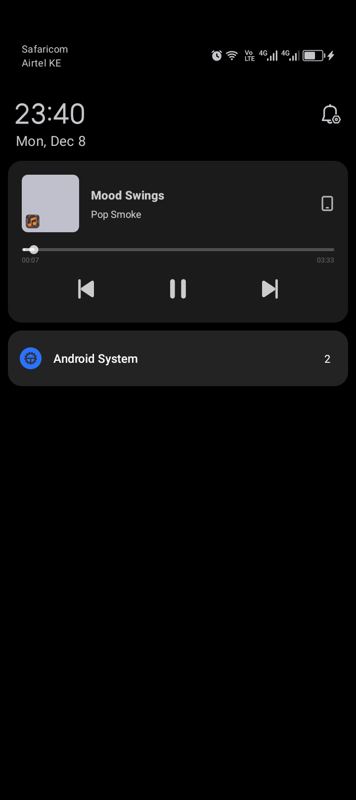  
  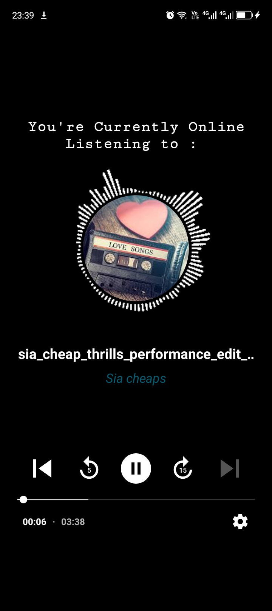  
  <br>Notification controls and Online player
</p>

---

## Technologies and Tools

* **Programming Language:** Java
* **Build System:** Gradle (Groovy)
* **Android SDK:** 36 (min SDK 24, target SDK 36)
* **UI/UX:** Material Design Components
* **Libraries & Dependencies:**
    * Firebase Authentication and Firestore
    * ExoPlayer (Media3)
    * Glide + Transformations
    * WaveformSeekBar
    * RecyclerView, Palette, and other AndroidX libraries

---

## Project Structure and Module Types

**Application Module**
* Uses `com.android.application` plugin
* Produces full APK/AAB for installation

**Library Module (optional)**
* Uses `com.android.library` plugin
* Provides reusable components

---

## Setup Instructions

```bash
git clone https://github.com/your-username/MusicPlayerApp.git
cd MusicPlayerApp
